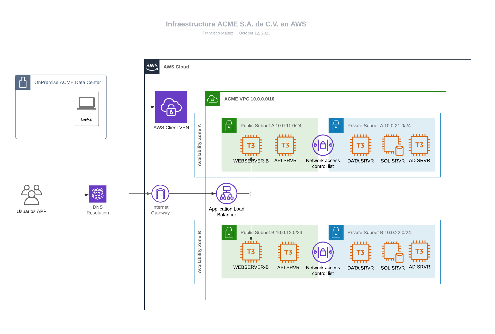
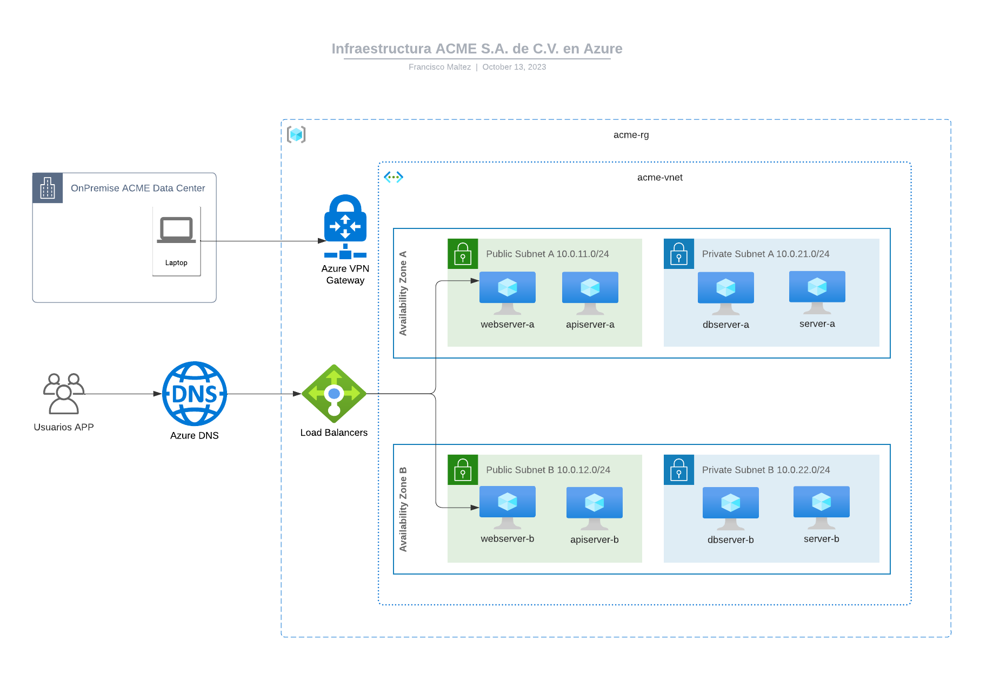

# Implementacion de infraestructura ACME
Definicion de Infraestructura como codigo para empresa ACME, en proveedores de nube AWS y Azure.

- [ ] Clonar repositorio git:
```sh
git clone https://github.com/adolfomaltez/terraform-acme-multicloud
cd terraform-acme-multicloud
```

# AWS



### Implementacion de infraestructura en AWS:
- [ ] Instalar awscli
- [ ] Configurar credenciales de AWS en /home/usuario/.aws/credentials
- [ ] Ejecutar codigo terraform
```sh
cd terraform-acme-multicloud
cd aws
terraform init
terraform plan
terraform apply -auto-approve
```
- [ ] Es necesario esperar de 10 a 15 minutos para el aprovisionamiento de la infraestructura.
- [ ] Validar acceso a aplicacion WEB (a traves del balanceador)
- [ ] Validar acceso SSH a servidores via VPN.
  - [ ] Descargar fichero de configuracion cliente VPN
  - [ ] Conectarse a VPN
  - [ ] Connectarse via SSH a los servidores.
- [ ] Destruir infraestructura para que no genere costos adicionales.
> **Warning**
> El Siguiente comando destruye toda la infraestructura.
```sh
terraform destroy
```

# Azure



### Implementacion de infraestructura en AWS:

- [ ] Instalar azcli
- [ ] az login
- [ ] Ejecutar codigo terraform
```sh
cd terraform-acme-multicloud
cd azure
terraform init
terraform plan
terraform apply -auto-approve
```
- [ ] Es necesario esperar de 20 a 30 minutos para el aprovisionamiento de la infraestructura.
- [ ] Validar acceso a aplicacion WEB (a traves del balanceador)
- [ ] Validar acceso SSH a servidores via VPN.
  - [ ] Descargar fichero de configuracion cliente VPN
  - [ ] Conectarse a VPN
  - [ ] Connectarse via SSH a los servidores.
- [ ] Destruir infraestructura para que no genere costos adicionales.

> **Warning**
> El Siguiente comando destruye toda la infraestructura.
```sh
terraform destroy
```

## References
- [Install the Azure CLI on Linux](https://learn.microsoft.com/en-us/cli/azure/install-azure-cli-linux?pivots=apt)